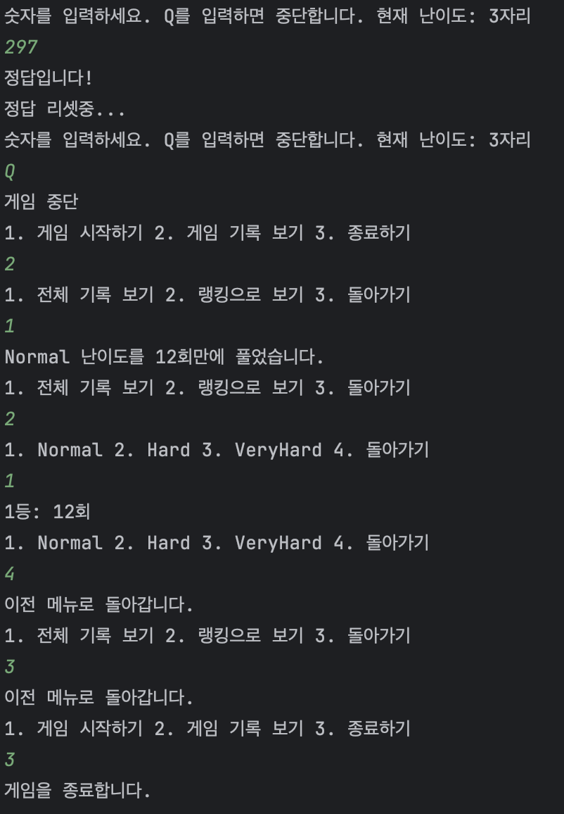

# Kotlin 숫자 야구 게임

## ✨ 240429-240503 내일배움캠프 3주차에 만든 숫자 야구 게임



<br/>
<h3>게임의 구조</h3>

> 1. [컨트롤러와 출력부](#컨트롤러와-출력부)
> 2. [게임 진행 객체](#게임-진행-객체)
> 3. [설계를 위한 data와 enum class](#설계를-위한-data와-enum-class)
> 4. [기록 저장용 파일입출력](#기록-저장용-파일입출력)
> 5. [Kotest 테스트 시나리오](#Kotest-테스트-시나리오)

<br/>
<br/>
<br/>
<br/>

### 컨트롤러와 출력부

>- View가 따로 존재하지 않으므로 Print 출력을 View라고 가정
>- 게임 모델에서 나오는 데이터와 유틸리티를 종합적으로 사용 및 통신
>- Controller 크기가 좀 방대해졌음

<details><summary>코드 보기</summary>

[Main.kt로 이동](src/main/kotlin/Main.kt)

```kotlin
/**
 * 게임 기본 메뉴를 출력한다.
 *
 */
fun showMenu() {
    println("< 게임을 시작합니다 >")

    do {
        println("1. 게임 시작하기 2. 게임 기록 보기 3. 종료하기")
        val menuInput = readln()

        when (menuInput) {
            "1" -> startGame()
            "2" -> showGameRecordMenu()
            "3" -> println("게임을 종료합니다.")
            else -> println("잘못 입력하셨습니다.")
        }
    } while (menuInput != "3")
}

/* 게임 기록 조회, 게임 난이도 선택, 랭킹 메뉴등 동일*/
// showGameRecordMenu()
// showGameRecordRankingMenu(records: List<String>)
```

Game 객체로 난이도를 정한 후 게임을 시작함

```kotlin
/**
 * 현재 진행중인 게임의 난이도 설정을 바꾼다.
 *
 * @param game: 현재 진행중인 게임 인스턴스
 */
fun setGameDifficulty(game: NumberBaseballGame) {
    while (true) {
        println("게임 난이도를 선택해주세요.")
        println("1. 보통(3자리) 2. 어려움(4자리) 3. 매우 어려움(5자리)")
        val difficultyInput = readln()

        game.difficulty = when (difficultyInput) {
            "1" -> NumberBaseballDifficulty.Normal
            "2" -> NumberBaseballDifficulty.Hard
            "3" -> NumberBaseballDifficulty.VeryHard
            else -> {
                println("입력값이 올바르지 않습니다.")
                continue
            }
        }

        break
    }
}
```

```kotlin
/**
 * 게임 인스턴스를 만들고 게임을 진행한다.
 *
 */
fun startGame() {
    val game = NumberBaseballGame()

    setGameDifficulty(game)

    while (true) {
        println("숫자를 입력하세요. Q를 입력하면 중단합니다. 현재 난이도: ${game.difficulty.length}자리")
        val input = readln()

        if (input == "Q") {
            println("게임 중단")
            return
        }

        with(game) {
            val status: NumberBaseballGameStatus

            try {
                status = checkInput(input)
            } catch (e: Exception) {
                println(e.message)
                return@with
            }

            when (status) {
                NumberBaseballGameStatus.Correct -> {
                    try {
                        baseballIOUtils.addGameRecord(game.getGameRecord())
                    } catch (e: Exception) {
                        println("게임 기록에 실패했습니다. :" + e.message)
                    }

                    println("정답입니다!")
                    println("정답 리셋중...")
                    resetGame()
                }

                NumberBaseballGameStatus.Progress -> {
                    getCurrentGameBallCount {
                        if (it.strike != 0) print("${it.strike}스트라이크 ")
                        if (it.ball != 0) print("${it.ball}볼 ")
                        println()
                    }
                }

                NumberBaseballGameStatus.Nothing -> {
                    println("Nothing")
                }
            }
        }
    }
}
```
</details>

---

### 게임 진행 객체

>- 게임 진행 데이터를 전부 갖고 관리하며 데이터를 입력받은 후 관련 예외 처리도 진행함
>- 사이즈에 비해 Data, Enum class 말고 관계가 취약하다는 느낌이 있음

<details><summary>코드 보기</summary>

[NumberBaseballGame.kt로 이동](src/main/kotlin/NumberBaseballGame.kt)

```kotlin
// 테스트 코드 작성용 answer 생성자
class NumberBaseballGame(private var answer: String = "") {
    // 직접적인 set 방지
    private var numberBaseballCount = NumberBaseballCount(0, 0)
    private var inputCount: Int = 0

    // 난이도 설정이 진행되면 게임 시작으로 간주하는 Setter 설정
    var difficulty: NumberBaseballDifficulty = NumberBaseballDifficulty.Normal
        set(value) {
            field = value
            this.resetGame()
        }
```

<h2>게임이 초기화될 때:</h2>

```kotlin
/**
 * 현재 게임 상태를 초기화합니다.
 *
 */
fun resetGame() {
    this.resetAnswer()
    this.resetGameCount(true)
}

/**
 * 현재 게임 정답을 초기화합니다.
 *
 */
private fun resetAnswer() {
    this.answer = ""

    do {
        this.answer = (0..9).toList().shuffled().slice(0 until this.difficulty.length).joinToString("")
    } while (this.answer.first() == '0')
}

/**
 * 숫자 야구 게임에 사용중인 카운팅 변수를 초기화합니다.
 *
 */
private fun resetGameCount(withInput: Boolean = false) {
    this.numberBaseballCount.strike = 0
    this.numberBaseballCount.ball = 0
    if (withInput) this.inputCount = 0
}
```

<h2>Controller로부터 입력값을 받아 처리할 때:</h2>

```kotlin
    /**
     * 정답과 비교해 현재 게임 상태에 맞는 NumberBaseballGameStatus를 반환합니다.
     *
     * @return NumberBaseballGameStatus
     */
    private fun validateAnswer(): NumberBaseballGameStatus {
        return when {
            this.numberBaseballCount.strike == this.answer.length -> NumberBaseballGameStatus.Correct
            this.numberBaseballCount.strike > 0 || this.numberBaseballCount.ball > 0 -> NumberBaseballGameStatus.Progress
            else -> NumberBaseballGameStatus.Nothing
        }
    }

    /**
     * 입력받은 값을 정답과 비교해 NumberBaseballGameStatus로 정답 여부를 반환합니다
     *
     * @param input: 입력받은 값
     * @return NumberBaseballGameStatus: Nothing, Progress, Correct 세 가지 상태중 하나입니다.
     */
    fun checkInput(input: String): NumberBaseballGameStatus {
        val inputCharList = Regex("""\d""").findAll(input).map { it.value.single() }.toList()
        val answerLength = this.answer.length

        if (inputCharList.count() != answerLength) { throw Exception("입력값이 올바르지 않습니다.") }
        if (inputCharList.first() == '0') { throw Exception("첫 번째 숫자는 0이 될 수 없습니다.") }
        if (inputCharList.distinct().count() < answerLength) { throw Exception("중복 값이 있습니다.") }

        this.resetGameCount()
        this.increaseInputCount()

        (0 until answerLength).forEach { index ->
            if (this.answer[index] == inputCharList[index]) { this.numberBaseballCount.strike++ }
            else if (this.answer.contains(inputCharList[index])) { this.numberBaseballCount.ball++ }
        }

        return this.validateAnswer()
    }
```

<h2>Controller가 게임의 정보를 필요로 할 때:</h2>

```kotlin
    /**
     * 현재 스트라이크, 볼 카운트를 담고 있는 NumberBaseballCount 객체를 completion으로 전달합니다.
     *
     * @param completion: Strike, Ball 정보를 가진 NumberBaseballCount를 전달합니다
     */
    fun getCurrentGameBallCount(completion: (NumberBaseballCount) -> Unit) {
        completion(this.numberBaseballCount)
    }

    /**
     * 현재 게임 기록을 반환합니다.
     *
     */
    fun getGameRecord() = NumberBaseballGameRecord(this.difficulty, this.inputCount)
```

</details>

---

### 설계를 위한 data와 enum class

> - 코드의 가독성, 이해도 증가를 위해 Enum, Data class로 모델을 만들어 이름을 명시

<details><summary>코드 보기</summary>

[model package로 이동](src/main/kotlin/model)

```kotlin
data class NumberBaseballCount(var strike: Int, var ball: Int)

enum class NumberBaseballDifficulty(var length: Int) {
    Normal(3),
    Hard(4),
    VeryHard(5)
}

data class NumberBaseballGameRecord(val difficulty: NumberBaseballDifficulty, val inputCount: Int)

enum class NumberBaseballGameStatus {
    Nothing,
    Progress,
    Correct
}
```

```kotlin
// 객체로 관리
fun getCurrentGameBallCount(completion: (NumberBaseballCount) -> Unit)
// 사용
getCurrentGameBallCount {
    if (it.strike != 0) print("${it.strike}스트라이크 ")
    if (it.ball != 0) print("${it.ball}볼 ")
    println()
}
```

</details>

---

### 기록 저장용 파일입출력

> - 한 번의 실행에서만 기록을 관리하지 않고 유지하기 위해 파일입출력 사용
> - Android 에서는 SQLite 썼는데 JVM 상에선 Storage 개념이 달라 권장하지 않는듯?

<details><summary>코드 보기</summary>

[GameRecordIOUtils.Kt로 이동](src/main/kotlin/utils/GameRecordIOUtils.kt)
```kotlin
class GameRecordIOUtils private constructor() {
    private val file = File(Constants.RECORD_FILE_PATH)

    /**
     * 게임 기록을 파일에서 읽어 줄마다 구분해 반환합니다.
     *
     * @return 게임 기록이 담긴 List<String>
     */
    fun getGameRecords(): List<String> {
        if (this.file.readLines().isEmpty()) throw Exception("게임 기록이 없습니다.")

        return this.file.readLines()
    }

    /**
     * NumberBaseballGameRecord에서 난이도와 입력 횟수를 얻어 파일에 기록합니다.
     *
     * @param 한 게임이 끝난 기록이 담긴 NumberBaseballGameRecord
     */
    fun addGameRecord(gameRecord: NumberBaseballGameRecord) {
        this.file.appendText("${gameRecord.difficulty.name}:${gameRecord.inputCount}\n")
    }

    companion object {
        private var instance: GameRecordIOUtils? = null

        /**
         * 유틸리티는 Singleton instance로 관리
         *
         */
        fun getInstance(): GameRecordIOUtils = instance ?: GameRecordIOUtils()
    }
}
```
</details>

---

### Kotest 테스트 시나리오

> - 강의에서 배운 Kotest 테스트 프레임워크로 간단한 테스트 코드 작성
> - 다채로운 테스트는 노하우가 부족해 아직 어렵게 느껴짐

<details><summary>코드 보기</summary>

[NumberBaseballTest.kt로 이동](src/test/kotlin/NumberBaseballTest.kt)
```kotlin
class NumberBaseballTest : BehaviorSpec({

    Given("정답이 384, 입력이 318 일때") {
        val game = NumberBaseballGame("384")
        val input = "318"

        When("입력하고 볼 카운트를 체크하면") {
            var strike = 0
            var ball = 0
            val status = game.checkInput(input)
            game.getCurrentGameBallCount {
                strike = it.strike
                ball = it.ball
            }

            Then("1스트라이크 1볼이어야 한다") {
                status shouldBe NumberBaseballGameStatus.Progress
                strike shouldBe 1
                ball shouldBe 1
            }
        }
    }

    /* 그 외 입력값 시나리오 */

    Given("정답이 384, 입력이 30 일때") {
        val game = NumberBaseballGame("384")
        val input = "30"

        When("입력하면") {
            val exception = shouldThrow<Exception> { game.checkInput(input) }

            Then("입력값이 올바르지 않아야 한다") {
                exception.message shouldBe "입력값이 올바르지 않습니다."
            }
        }
    }

    /* 그 외 예외처리 시나리오 */
})
```
</details>

---

### 추가하고 싶은 기능

- 더 많은 시나리오를 처리하는 테스트 코드
- 방대해진 Controller의 기능 분리
- 빈약하게 느껴지는 게임 클래스의 관계 구조 개선
- IDE에서 생성되는 커밋 찌꺼기들 관리/처리법 (ignore template 에서도 보지 못한)


### 개발 환경

- Language : Kotlin 1.9.23
- IDE : IntelliJ
- JDK : openjdk-21
- dependencies
  - Kotest: 5.8.1
